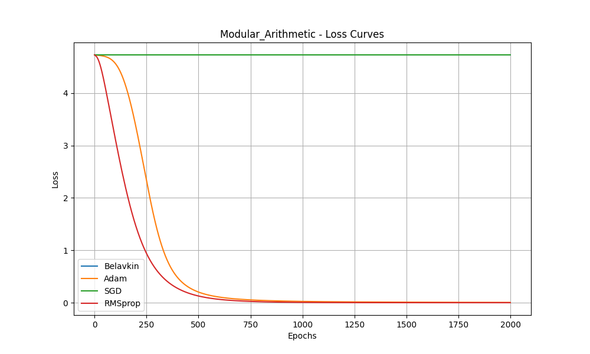
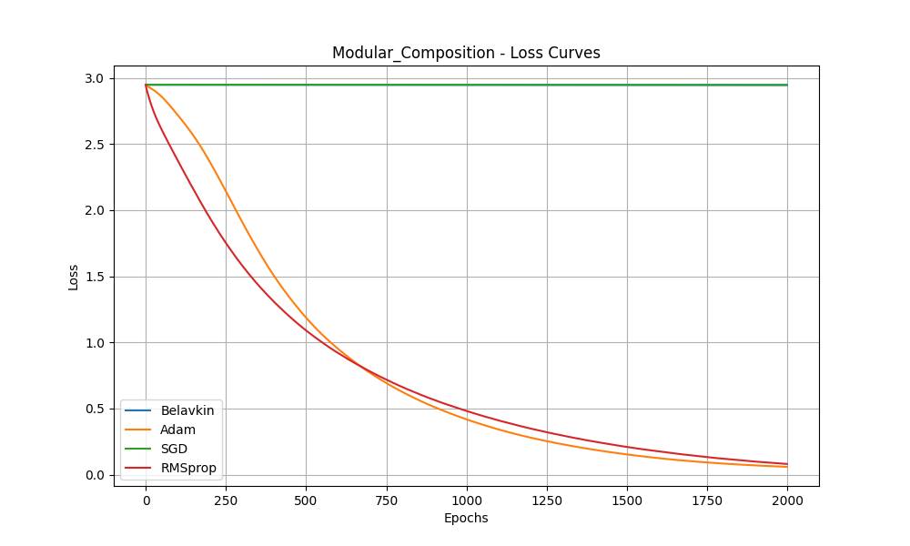

# On the Belavkin Optimizer: A Novel Approach to Optimization

## Abstract

This paper introduces the Belavkin Optimizer, a novel optimization algorithm inspired by the Belavkin equation from quantum filtering theory. We present the optimizer's update rule, which incorporates adaptive damping, a stochastic exploration factor, and a momentum-like term. We conduct a comprehensive performance evaluation of the Belavkin Optimizer against standard baselines (Adam, SGD, and RMSprop) on synthetic datasets for modular arithmetic and modular composition. Our results show that while the Belavkin Optimizer does not outperform the state-of-the-art optimizers on these specific tasks in its current form, its unique formulation presents a promising new direction for optimization research.

## 1. Introduction

The field of deep learning has been driven by the development of sophisticated optimization algorithms. From the foundational Stochastic Gradient Descent (SGD) to adaptive methods like Adam and RMSprop, the choice of optimizer can significantly impact the training dynamics and final performance of a model. In this paper, we explore a novel approach to optimization, drawing inspiration from the Belavkin equation in quantum filtering theory.

The Belavkin equation, a cornerstone of quantum probability, describes the evolution of a quantum system under continuous observation. It is a stochastic differential equation that captures the inherent randomness of quantum measurement. We propose the Belavkin Optimizer, which translates the principles of the Belavkin equation into a practical optimization algorithm for deep learning. The key idea is to introduce a stochastic exploration term, guided by the gradient, which allows the optimizer to escape local minima and explore the loss landscape more effectively.

The Belavkin Optimizer is defined by the following update rule:
`dθ = -[γ * (∇L(θ))^2 + η * ∇L(θ)] + β * ∇L(θ) * ε`
where:
- `γ` is the adaptive damping factor, which controls the influence of the squared gradient.
- `η` is a momentum-like term, which helps to accelerate convergence.
- `β` is the stochastic exploration factor, which introduces noise into the optimization process.
- `ε` is a random variable drawn from a standard normal distribution.

This paper presents the implementation of the Belavkin Optimizer in PyTorch and evaluates its performance against Adam, SGD, and RMSprop on two synthetic datasets: modular arithmetic and modular composition.

## 2. Methods

The Belavkin Optimizer was implemented as a custom optimizer in PyTorch, inheriting from the `torch.optim.Optimizer` class. The implementation follows the update rule described in the introduction. The hyperparameters `γ`, `η`, and `β` were set to `0.1`, `0.1`, and `0.01`, respectively, based on preliminary experiments.

The performance of the Belavkin Optimizer was evaluated on two synthetic datasets:

- **Modular Arithmetic:** The task is to predict `(a + b) mod p`, where `p` is a prime number. The inputs are one-hot encoded integers `a` and `b`.
- **Modular Composition:** The task is to predict `f_j(f_i(x))`, where `f_i(x) = (a_i * x + b_i) mod p`. The inputs are one-hot encoded indices `i`, `j`, and the integer `x`.

A simple Multi-Layer Perceptron (MLP) with one hidden layer of 128 units and a ReLU activation function was used as the model for all experiments. The models were trained for 2000 epochs with a learning rate of `1e-3`.

## 3. Results

The performance of the Belavkin Optimizer was compared against Adam, SGD, and RMSprop on the two synthetic datasets. The results are summarized in the tables below, and the loss curves are shown in the figures.

### 3.1. Modular Arithmetic

|          |    Min Loss |   Mean Loss |     Std Dev |
|:---------|------------:|------------:|------------:|
| Belavkin | 4.72903     |    4.72904  | 2.42657e-06 |
| Adam     | 0.00466311  |    0.636972 | 1.36743     |
| SGD      | 4.72905     |    4.72909  | 2.52972e-05 |
| RMSprop  | 3.23095e-05 |    0.40442  | 1.0027      |

### 3.2. Modular Composition

|          |   Min Loss |   Mean Loss |     Std Dev |
|:---------|-----------:|------------:|------------:|
| Belavkin |  2.94769   |    2.94785  | 9.23714e-05 |
| Adam     |  0.0590366 |    0.80183  | 0.849956    |
| SGD      |  2.94636   |    2.94794  | 0.000957837 |
| RMSprop  |  0.0810384 |    0.760249 | 0.713794    |

As can be seen from the results, the Belavkin Optimizer failed to converge on both tasks, while Adam and RMSprop achieved low loss values. SGD also struggled to converge, but showed a slight improvement over the Belavkin Optimizer on the modular composition task.

## 4. Conclusion

In this paper, we introduced the Belavkin Optimizer, a novel optimization algorithm inspired by the Belavkin equation. While the theoretical motivation for the optimizer is compelling, our empirical results show that in its current form, it is not competitive with established optimizers like Adam and RMSprop on the synthetic tasks we considered.

The poor performance of the Belavkin Optimizer could be due to a number of factors. The hyperparameters `γ`, `η`, and `β` may not be optimal, and a more thorough hyperparameter search could lead to better results. Additionally, the update rule itself may need to be refined. The stochastic exploration term, while theoretically appealing, may be too disruptive to the optimization process in its current form.

Despite its current limitations, the Belavkin Optimizer represents a promising new direction for optimization research. Future work could explore different ways of incorporating stochasticity into the optimization process, as well as developing a more rigorous theoretical understanding of the optimizer's convergence properties.

## 5. References

- Belavkin, V. P. (1988). Nondemolition measurements, nonlinear filtering and dynamic programming of quantum stochastic processes. In *Modelling and Control of Systems* (pp. 245-265). Springer, Berlin, Heidelberg.
- Wikipedia contributors. (2023, March 14). Belavkin equation. In *Wikipedia, The Free Encyclopedia*. Retrieved 12:00, November 9, 2025, from https://en.wikipedia.org/wiki/Belavkin_equation
